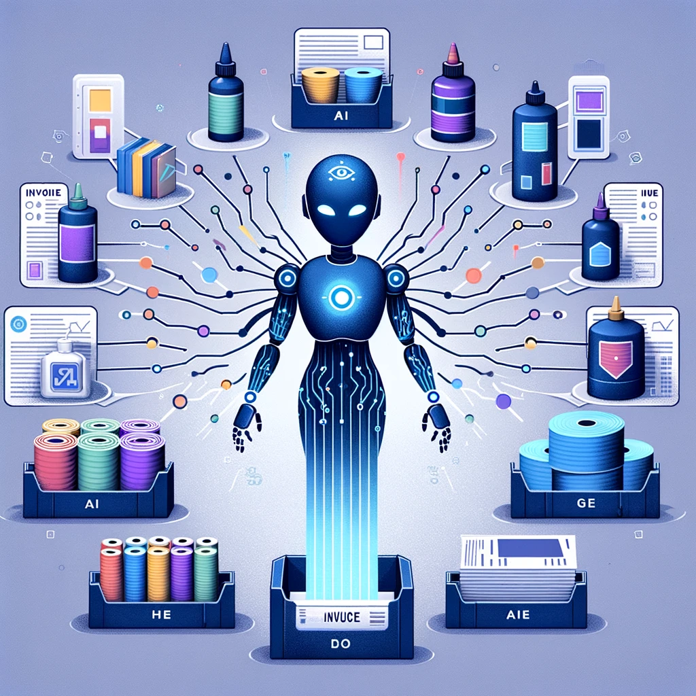
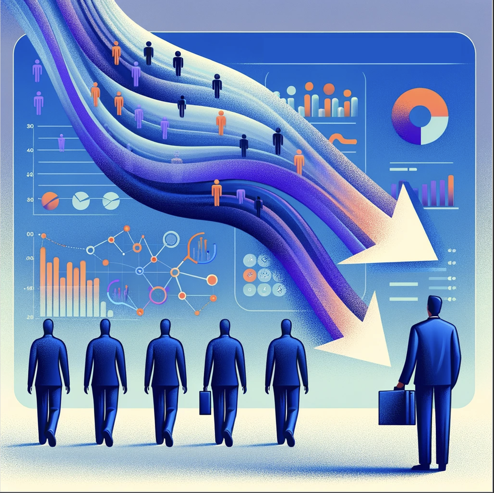

# LalehAE.github.io

# Welcome to Laleh's Data Science Portfolio

## About Me

I care about responsible, transparent AI: systems that show how they arrived at an answer, respect data boundaries, and keep domain experts in control of decisions. I am Laleh, a Lead Data Scientist who designs AI solutions around complex data where accuracy and trust really matter.

Most recently, as Lead Data Scientist at TREK Geotechnical in Winnipeg, I led the company’s AI and data modernization roadmap. Instead of putting a chatbot on top of messy legacy files, I designed and implemented a new data foundation: using language models to help clean and consolidate thousands of historical geotechnical files into a structured Postgres/PostGIS database, surfaced through a Google Earth view with location-accuracy flags and a feedback loop so engineers could review and correct critical records.

On top of that foundation I built a secure conversational layer over the enterprise database so geotechnical engineers and researchers can ask multi-step questions in natural language, see results on a map, download KMZ and CSV outputs, and understand which data, filters and reasoning were used in each answer, while raw data stays safely inside company systems.

My best work happens between domain experts, product and engineering: listening to how people really work, clarifying the problem, shaping the data and AI approach, and guiding it into something teams trust and actually use.

 

- **Email**: [la.asadzadeh@gmail.com](mailto:la.asadzadeh@gmail.com)
- **LinkedIn**: [linkedin.com/lalehas](https://www.linkedin.com/in/lalehas/)
- **Github**: [github.com/LalehAE](https://github.com/LalehAE)

## Projects

Below is a curated selection of projects that show how I approach real-world AI and data problems: from LLM based assistants and agents, to recommender systems, computer vision, and analytics for decision making.

 

 **[Autonomous ETL & Data Analytics](https://LalehAE.github.io/pages/GenAI.html)**

Empowering businesses to harness their data effortlessly, this project utilizes AI agents created with OpenAI and LangChain to navigate complex databases, like SAP, without requiring deep database knowledge. It features an innovative AI-driven system that interprets user queries, identifies relevant data, and autonomously generates Python scripts for analysis. The system further advises on visualization and business insights, streamlining decision-making and fostering a culture of data-driven intelligence.

 

 **[Aircraft Turnaround](https://LalehAE.github.io/pages/Aircraft.html)**

Innovating airport operations, this application empowers airline managers with real-time monitoring of aircraft turnaround. It uses advanced computer vision and a Yolo model to analyze CCTV footage, annotate events, and present live dashboards via Azure, reducing delays and enhancing efficiency. 

 
 

 **[Procurement Item Classification](https://LalehAE.github.io/pages/Items.html)**

I developed a Catboost model to classify procurement invoices into more than 30 distinct categories, achieving a macro-average accuracy of 86%. This classification facilitates direct spend analysis, uncovering hidden costs and ensuring spend accuracy, which is vital for creating cost-saving procurement strategies. Additionally, I optimized the existing post-processing procedure, cutting down its runtime by 30%, thereby improving the overall efficiency of the procurement process.

 

 **[Content Recommender Engine](https://LalehAE.github.io/pages/Content.html)**

Developed a multilingual content recommender engine using TensorFlow Recommenders (TFRS), fine-tuned with Kubeflow and managed by an Apache Airflow pipeline on GCP. Enhanced the system to support 105 languages, improving the scope and inclusivity of user recommendations. Optimized the recommendation filtering process, ensuring users only receive current and relevant content. Future developments include A/B testing to evaluate user engagement and further refine the recommendation algorithm.

 

 **[Social Media Recommender Engine](https://LalehAE.github.io/pages/Social.html)**

A cutting-edge POC that transforms social connectivity by leveraging deep learning to analyze user data and match profiles with shared interests and goals. The innovative use of LaBSE for vector embeddings and cosine similarity scores significantly outperforms traditional clustering, readying the system for expansion to a broader user base. 

 
 

  **[Cohort Churn Analysis](https://LalehAE.github.io/pages/Cohort.html)**

Delving into user retention, this analysis informed strategic adjustments by evaluating churn rates across various memberships. Collaborative efforts in defining churn and securing necessary data culminated in live churn data tables and dashboards, influencing the company's decision to optimize its membership focus. 

 
 

## Core Competencies
- **Programming:** Python (NumPy, Pandas, Scikit-Learn, Keras, NLTK, SciPy), SQL, R, Spark
- **Machine Learning:** Linear Regression, Regularisation (Ridge, Lasso, Elastic), Logistic Regression, Naive Bayes, Decision Tree, Random Forest, CatBoost, XGBoost, LightGBM, K-Nearest Neighbour (KNN), Support Vector Machine (SVM), Clustering (K-Means, Hierarchical Clustering, DBSCAN), Dimension Reduction (PCA, t-SNE), NLP(BERT, LaBSE)
- **Statistical Analysis:** Descriptive & Inferential Statistics, Regression Modeling & Evaluation, Time Series Forecasting
- **Technologies:** Large Language Models (LLM), Microsoft Azure Cloud Platform, Databricks, Google Cloud Platform, Airflow, Kubeflow
- **BI Tools:** Tableau, Google Data Studio
- **Industries:** Data Infrastructure and Analytics, E-Learning, Technology Information and Internet, Manufacturing
- **Soft Skills:** Problem-solving, Communication, Leadership, Critical Thinking, Attention to Detail, Cultural Competence

## Education
- **MSc, Southern Illinois University**, Computer Science, United States

- **MBA, Industrial Management Institute**, Executive Management, Iran

- **MSc, Sharif University of Technology**, Mathematics, Iran

- **BSc, Isfahan University of Technology**, Mathematics, Iran

## CONFConference Publications & Presentations
-	**Laleh, A.** (2019, March). Data Science: Demystifying Technical Terms, Data for Her, Shell Malaysia

-	**Laleh, A.** (2018, June). Data Science Industry, Presentation, British Council Malaysia, [Watch My Talk](https://www.youtube.com/watch?v=Tuuv-X8c5ts)

-	**Laleh, A.**, & Shahram, R. (2017, December). Analyzing Facebook Activities for Personality Recognition. In *Machine Learning and Applications (ICMLA), 2017 16th IEEE International Conference* on (pp. 960-964). IEEE.

## Professional Endorsements

> "Laleh has been a valuable member of the CADS data science team, with deep understanding of statistics, time-series analysis and machine learning, eager to work and find innovative ways to solve any project/puzzle she would face. All the best in your next endeavors!"
> [**- Stamatis Kourtis, Chief Data Officer at The Center of Applied Data Science**](https://www.linkedin.com/in/stamatis-kourtis-3624121/)

> "I always enjoy working with Laleh. She's forthright, persistent, and capable of changing her mind based on data. The last trait is my favorite. You can always count on her to stat the facts and then her thoughts on the facts in context to the situation/problem. Oh, and she's amazing at the more technical elements of Machine Learning, Inferential Stats, Times Series forecasting, and on and on. Laleh is a great asset to my or any team."
> [**- Zachary Johnson, Chief Product Officer  at The Center of Applied Data Science**](https://www.linkedin.com/in/zjamesjohnson/)

> "I had the chance of teaching Management Of Technology and Innovation to L.A. (not "Los Angeles"! I mean Ms. Laleh Asadzadeh) and her nice classmates at IMI in Spetember 2012. I found her very talented, enthusiastic, involved and serious at studies. I really enjoyed speaking at their class, especially with a number of outstanding students like Ms. Asadzadeh."
> [**- Fariborz Davarpanah, Lecturer at Industrial Management Institute**](https://www.linkedin.com/in/fariborz-davarpanah-4a9ba536/) 
