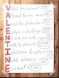

# LalehAE.github.io

# Welcome to Laleh's Data Science Portfolio

## About Me

Hello! I'm Laleh, a passionate data scientist with a focus on machine learning and AI. My journey in data science is underscored by a foundation in mathematics and executive management, where leveraging data for decision-making and insight discovery is at the core of what I do.

A unique and memorable moment in my professional journey was when my manager, Zach, presented me with a piece of art as a Valentine's gift. More than a thoughtful gesture, this artwork used the VALENTINE alphabet to encapsulate qualities he saw in me, qualities that I strive to embody in my professional and personal interactions:

- **Valued for counsel**: What should I do?
- **Attend to our need**: We all need ...
- **Loves the students**:  I am so proud
- **Enjoy a challenge**: That sounds difficult. Let me ...
- **No sub-par work, ever**: This is not up to our standard
- **Truth to stupid**: You are wrong. Here is why ...
- **Infectious laughter**: HA HA HA HA HA
- **Noble Patience**: You will get there
- **Earnest**: Let me share my feelings

 [Zach's Artwork for Laleh](images/zach.png) _"Valentine Alphabet for Laleh," a creative expression of the traits that I bring to my professional endeavors._

Each of these attributes, represented through Zach's creative lens, highlights the blend of technical expertise, leadership, and interpersonal skills I bring to the field of data science. It's a reminder of the impact we can have through our work, the value of clear communication and empathy, and the importance of maintaining a positive, earnest approach in all our endeavors.

- **Email**: [la.asadzadeh@gmail.com](mailto:la.asadzadeh@gmail.com)
- **LinkedIn**: [linkedin.com/lalehas](https://www.linkedin.com/in/lalehas/)

## Projects

Here is a curated collection of my projects, each meticulously detailed with information on the objective, methodology, and implementation. Within this collection, you'll discover comprehensive insights into my projects, with each one thoroughly explained in terms of its objective, methodology, and implementation aspects. Notably, the GenAI project is accompanied by a sample code repository, offering a tangible glimpse into the practical application of its underlying solution.

 
 **[Autonomous ETL & Data Analytics](https://LalehAE.github.io/pages/GenAI.html)**

Empowering businesses to harness their data effortlessly, this project utilizes AI agents created with OpenAI and LangChain to navigate complex databases, like SAP, without requiring deep database knowledge. It features an innovative AI-driven system that interprets user queries, identifies relevant data, and autonomously generates Python scripts for analysis. The system further advises on visualization and business insights, streamlining decision-making and fostering a culture of data-driven intelligence.

 

 **[Aircraft Turnaround](https://LalehAE.github.io/pages/Aircraft.html)**

Innovating airport operations, this application empowers airline managers with real-time monitoring of aircraft turnaround. It uses advanced computer vision and a Yolo model to analyze CCTV footage, annotate events, and present live dashboards via Azure, reducing delays and enhancing efficiency. 

 

 **[Social Media Recommender Engine](https://LalehAE.github.io/pages/Social.html)**

A cutting-edge POC that transforms social connectivity by leveraging deep learning to analyze user data and match profiles with shared interests and goals. The innovative use of LaBSE for vector embeddings and cosine similarity scores significantly outperforms traditional clustering, readying the system for expansion to a broader user base. 

 

  **[Cohort Churn Analysis](https://LalehAE.github.io/pages/Cohort.html)**

Delving into user retention, this analysis informed strategic adjustments by evaluating churn rates across various memberships. Collaborative efforts in defining churn and securing necessary data culminated in live churn data tables and dashboards, influencing the company's decision to optimize its membership focus. 

 

##  Core Competencies

- **Programming:** Python (NumPy, Pandas, Scikit-Learn, Keras, NLTK, SciPy), SQL, R, Spark 

- **Machine Learning:** Linear Regression, Regularisation (Ridge, Lasso, Elastic), Logistic Regression, Naive Bayes, Decision Tree, Random Forest, Catboost, Xgboost, Lightgbm, K-Nearest Neighbour (KNN), Support Vector Machine (SVM), Clustering (K-Means, Hierarchical Clustering, DBSCAN), Dimension Reduction (PCA, T-SNE), NLP(BERT, LaBSE)

- **Statistical Analysis:** Descriptive & Inferential Statistics, Regression Modeling & Evaluation, Time Series Forecasting

- **Technologies:** Large Language Models (LLM), Microsoft Azure Cloud Platform, Databricks, Google Cloud Platform, Airflow, Kubeflow

- **BI Tools:** Tableau, Google Data Studio

- **Industries:** Data Infrastructure and Analytics, E-Learning, Technology Information and Internet

- **Soft Skills:** Problem-solving, Communication, Leadership, Critical Thinking, Attention to Detail, Cultural Competence

## Education
- **MSc, Southern Illinois University**, Computer Science, United States

- **MBA, Industrial Management Institute**, Executive Management, Iran

- **MSc, Sharif University of Technology**, Mathematics, Iran

- **BSc, Isfahan University of Technology**, Mathematics, Iran

## CONFERENCE PUBLICATIONS & PRESENTATIONS

-	**Laleh, A.** (2019, March). Data Science: Demystifying Technical Terms, Data for Her, Shell Malaysia

-	**Laleh, A.** (2018, June). Data Science Industry, Presentation, British Council Malaysia, [Watch My Talk](https://www.youtube.com/watch?v=Tuuv-X8c5ts)

-	**Laleh, A.**, & Shahram, R. (2017, December). Analyzing Facebook Activities for Personality Recognition. In *Machine Learning and Applications (ICMLA), 2017 16th IEEE International Conference* on (pp. 960-964). IEEE.

## Professional Endorsements

> "Laleh has been a valuable member of the CADS data science team, with deep understanding of statistics, time-series analysis and machine learning, eager to work and find innovative ways to solve any project/puzzle she would face. All the best in your next endeavors!"
> [**- Stamatis Kourtis, Chief Data Officer at The Center of Applied Data Science**](https://www.linkedin.com/in/stamatis-kourtis-3624121/)

> "I always enjoy working with Laleh. She's forthright, persistent, and capable of changing her mind based on data. The last trait is my favorite. You can always count on her to stat the facts and then her thoughts on the facts in context to the situation/problem. Oh, and she's amazing at the more technical elements of Machine Learning, Inferential Stats, Times Series forecasting, and on and on. Laleh is a great asset to my or any team."
> [**- Zachary Johnson, Chief Product Officer  at The Center of Applied Data Science**](https://www.linkedin.com/in/zjamesjohnson/)

> "I had the chance of teaching Management Of Technology and Innovation to L.A. (not "Los Angeles"! I mean Ms. Laleh Asadzadeh) and her nice classmates at IMI in Spetember 2012. I found her very talented, enthusiastic, involved and serious at studies. I really enjoyed speaking at their class, especially with a number of outstanding students like Ms. Asadzadeh."
> [**- Fariborz Davarpanah, Lecturer at Industrial Management Institute**](https://www.linkedin.com/in/fariborz-davarpanah-4a9ba536/) 

