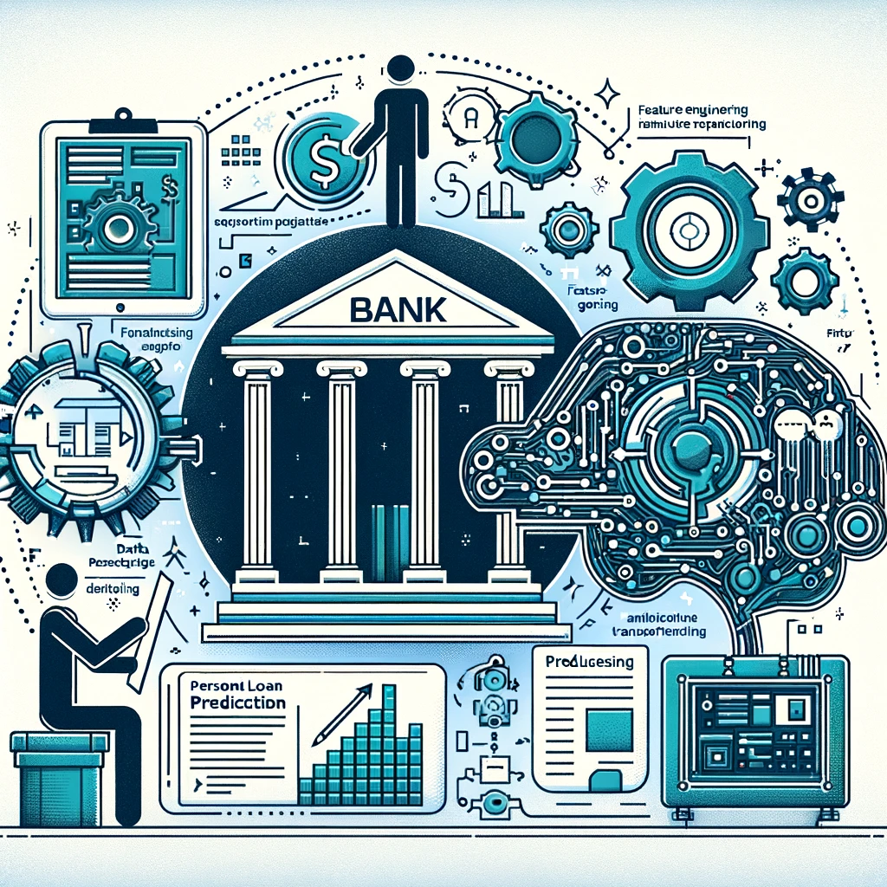

# LalehAE.github.io

# Welcome to Laleh's Data Science Portfolio

## About Me
Hello! I'm Laleh, a passionate data scientist with a focus on machine learning and AI. With a background in Data Science, Mathematics and Executive Management. I leverage data to drive decision-making and uncover insights.

## Projects
Here you'll find a selection of my projects showcasing my skills in GenAI, Machine Learning and data analysis. Each project includes a detailed README with an overview, methodologies, and key findings.

<!DOCTYPE html>
<html>
<head>
  <link rel="stylesheet" type="text/css" href="styles.css">
  
</head>
<body>

  

    
  

  

    
<b style="color: SlateBlue;">Autonomous ETL & Data Analytics</b> 

    
Empowering businesses to harness their data effortlessly, this project utilizes <i>AI agents</i> created with <i>OpenAI</i> and <i>LangChain</i> to navigate complex databases, like SAP, without requiring deep database knowledge. It features an innovative AI-driven system that interprets user queries, identifies relevant data, and autonomously generates Python scripts for analysis. The system further advises on visualization and business insights, streamlining decision-making and fostering a culture of data-driven intelligence.

    
<a href="pages/GenAI.html">Learn More</a>

  

  

    
  

  

    
<b style="color: SlateBlue;">Aircraft Turnaround</b> 

    
Innovating airport operations, this application empowers airline managers with real-time monitoring of aircraft turnaround. It uses advanced computer vision and a Yolo model to analyze CCTV footage, annotate events, and present live dashboards via Azure, reducing delays and enhancing efficiency.

    
<a href="pages/Aircraft.html">Learn More</a>

  

  

    
  

  

    
<b style="color: SlateBlue;">Social Media Recommender Engine</b> 

    
A cutting-edge POC that transforms social connectivity by leveraging deep learning to analyze user data and match profiles with shared interests and goals. The innovative use of LaBSE for vector embeddings and cosine similarity scores significantly outperforms traditional clustering, readying the system for expansion to a broader user base.

    
<a href="pages/Social.html">Learn More</a>

  

  

    
  

  

    
<b style="color: SlateBlue;">Cohort Churn Analysis</b> 

    
Delving into user retention, this analysis informed strategic adjustments by evaluating churn rates across various memberships. Collaborative efforts in defining churn and securing necessary data culminated in live churn data tables and dashboards, influencing the company's decision to optimize its membership focus.

    
<a href="path/to/Cohort.html">Learn More</a>

  

  

    
  

  

    <b>Loan Default Prediction</b>
  

</body>
</html>
 

## Skills
**Programming:** Python (NumPy, Pandas, Scikit-Learn, Keras, NLTK, SciPy), SQL, R, Spark 

**Machine Learning:** Linear Regression, Regularisation (Ridge, Lasso, Elastic), Logistic Regression, Naive Bayes, Decision Tree, Random Forest, Catboost, Xgboost, Lightgbm, K-Nearest Neighbour (KNN), Support Vector Machine (SVM), Clustering (K-Means, Hierarchical Clustering, DBSCAN), Dimension Reduction (PCA, T-SNE), NLP(BERT, LaBSE)

**Statistical Analysis:** Descriptive & Inferential Statistics, Regression Modeling & Evaluation, Time Series Forecasting

**Technologies:** Large Language Models (LLM), Microsoft Azure Cloud Platform, Databricks, Google Cloud Platform, FastAPI, Airflow, Kubeflow

**BI Tools:** Tableau, Google Data Studio

**Industries:** Data Infrastructure and Analytics, E-Learning, Technology Information and Internet

**Soft Skills:** Problem-solving, Communication, Teamwork

## Education
**MSc, Southern Illinois University**, Computer Science, United States
**MBA, Industrial Management Institute**, Executive Management, Iran
**MSc, Sharif University of Technology**, Mathematics, Iran
**BSc, Isfahan University of Technology**, Mathematics, Iran 

## Contact Me
Feel free to connect with me on [LinkedIn](https://www.linkedin.com/in/lalehas/) or email me at la.asadzadeh@gmail.com.
